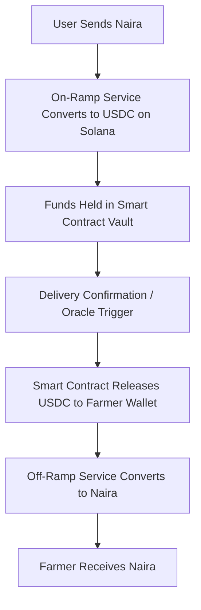

# 🐔 ChickChain | ChickenVaultSettlement – Fiat–Crypto Escrow Smart Contract

---

## 📌 Module Name: `AgricultureVaultSettlement`

---

## 🧠 Purpose

The `AgricultureVaultSettlement` module securely and transparently facilitates payments between **end-users paying in local fiat (e.g., Naira)** and **poultry suppliers/farmers** using a **Solana smart contract vault**.

The system enables:

- 🏦 On-ramping fiat to crypto using integrated payment gateways
- 🔐 Vault escrow on Solana for conditional release
- 🔄 Off-ramping crypto back to fiat for farmers after delivery verification

---

## 🔁 Workflow Overview



---

## ⚙️ System Components

| Component                 | Description                                                        |
| ------------------------- | ------------------------------------------------------------------ |
| **User**                  | Customer purchasing chicken with Naira                             |
| **On-Ramp Gateway**       | Service like Transak, Helipay, or Paychant to convert Naira → USDC |
| **ChickenVault Contract** | Escrow contract holding funds until delivery is verified           |
| **Delivery Oracle**       | Oracle or admin confirming successful delivery                     |
| **Farmer Wallet**         | Solana wallet to receive USDC                                      |
| **Off-Ramp Gateway**      | Converts USDC back to fiat (e.g., Pajcash)                         |
| **Settlement Module**     | Off-chain service that triggers off-ramp payout                    |

---

## 📄 Smart Contract Responsibilities

### ✅ Fund Reception

- Accepts USDC/SOL from on-ramp provider
- Maps deposit to a unique `OrderID` and farmer wallet

### 🛑 Vaulting

- Holds USDC in escrow until delivery is confirmed
- On-chain flag or oracle determines vault state

### 💸 Conditional Release

- Upon oracle confirmation, USDC is released to farmer

### 🧾 Audit Trail

- Emits logs for:

  - `DepositReceived`
  - `VaultCreated`
  - `DeliveryConfirmed`
  - `FundsReleased`

### 🔐 Security

- Oracle-only delivery triggers (admin/multisig)
- Non-custodial structure
- Reentrancy protection
- Timestamp-based fallback refunds

---

## 🏗️ Solana Integration Plan

### ✅ Tokens Used

- **USDC (SPL)** — Vault & settlement currency
- **Optional: `$AGT`** — Utility token for loyalty, governance, and reward layers

### 🔧 Smart Contract Type

- **Anchor framework** recommended for modular safety and clarity

### 📂 Key Accounts

| Account               | Purpose                                |
| --------------------- | -------------------------------------- |
| `UserAccount`         | Payer’s metadata + order linkage       |
| `OrderVault`          | Tracks funds, delivery, and status     |
| `FarmerWallet`        | Destination Solana wallet for USDC     |
| `SettlementAuthority` | Oracle or authority verifying delivery |

---

## 🔐 Security Considerations

- 🧠 Delivery oracle must be trusted and verifiable (GPS, QR, DAO trigger)
- 🔄 Refunds must be enforced via timeout if no delivery confirmation
- 🧾 On-chain logs for auditability
- ❌ Vault access must reject reentrant or duplicate release calls

---

## 📦 Example Use Case

```text
User wants to buy 2kg BBQ chicken worth ₦6,000
→ Pays via Naira payment gateway
→ On-ramp converts to $4 USDC → sent to ChickenVault
→ Funds mapped to Order ID + Farmer A's wallet
→ Rider delivers chicken and confirms via QR/oracle
→ ChickenVault releases $4 USDC to Farmer A
→ Off-ramp converts USDC → ₦6,000 → paid to Farmer A’s bank account
```

---

## 🛠️ Developer To-Do (Next Steps)

- [ ] Smart contract scaffolding (Anchor-based)
- [ ] Oracle integration logic
- [ ] On/Off-ramp API adapters (Helipay, Pajcash, etc.)
- [ ] Admin dashboard for confirmations/refunds
- [ ] Tokenomics layer for \$AGT incentives

---

## 📜 License

MIT License — Open-source, extensible for real-world Solana & agri-commerce.
